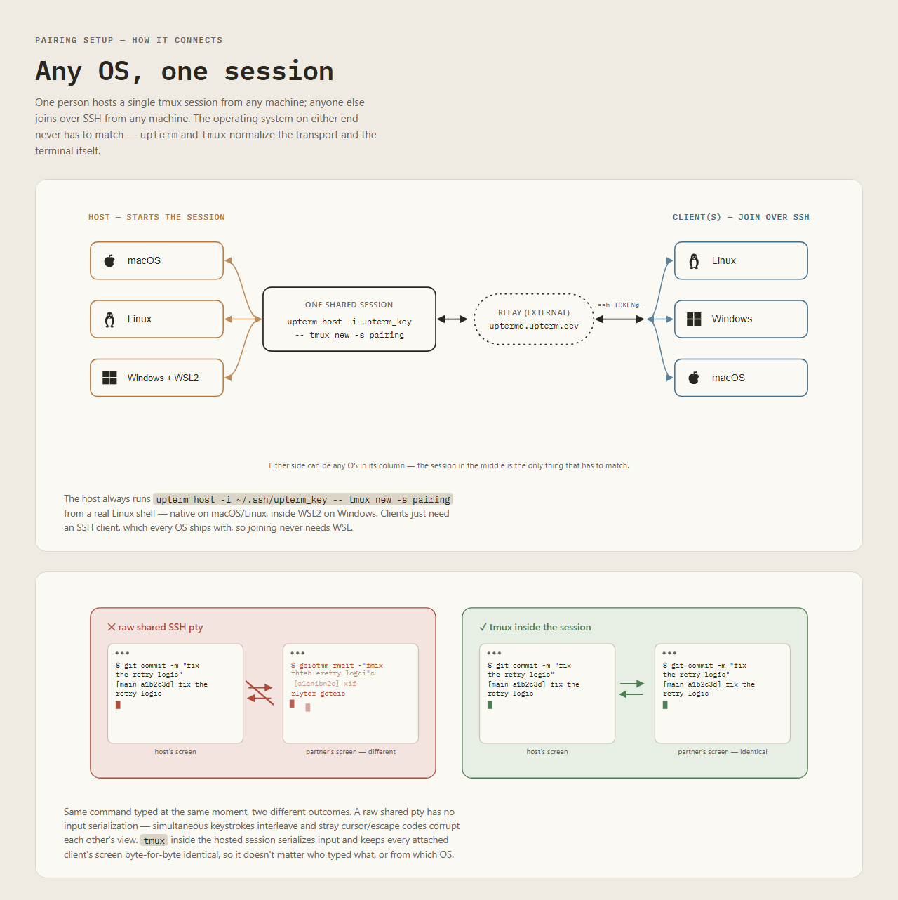

# Pairing setup (upterm + tmux + Claude Code)

Lets two or more people share one terminal, you can see each other typing 
— including a shared Claude Code session — without the garbled cursor/prompt corruption you get from a
raw shared SSH/pty session. A raw shared pty has no input serialization, so
simultaneous keystrokes interleave and break escape sequences, and
mismatched client window sizes break full-screen TUI redraws (which is
exactly what Claude Code's interactive prompt is). The fix is a
multiplexer (`tmux`) *inside* the shared session to serialize input and
sync screen size; `upterm` just provides the secure tunnel to reach it.



## Install

Clone this repo first, then run the installer from a terminal inside
`pairing-setup/` (all commands below assume you're in this folder):
```
git clone git@bitbucket.org:eforge/collaboration-tooling.git
cd collaboration-tooling/pairing-setup
```

**macOS / native Linux:**
```
./install-unix.sh
```

**Windows:** `tmux` has no native Windows build (`upterm` does, but the
session still needs `tmux`), so the session runs inside WSL2/Ubuntu.
```
./install-windows.ps1
```
If PowerShell refuses with *"running scripts is disabled on this
system"*, that's its default execution policy, not a problem with the
script — either run it once via
`powershell -ExecutionPolicy Bypass -File .\install-windows.ps1`, or set
`Set-ExecutionPolicy -Scope CurrentUser RemoteSigned` for your account.
This bootstraps WSL/Ubuntu if it isn't already set up (installing the WSL
platform requires one reboot if it's genuinely your first time — the
script tells you when to re-run it), then calls `install-unix.sh` inside
that WSL environment. Both scripts are safe to re-run — every step skips
work that's already done.\
After succesful WSL installation (See Troubleshooting (Windows/WSL) section) you'll find in your IDE an "Ubuntu" in your terminal list.

On Windows this means everything the script sets up — Node, Claude Code,
and the `~/.ssh/upterm_key` below — lives *inside* that WSL/Ubuntu
environment, separate from anything already installed on Windows itself.
Always run `claude` and `upterm host` from that same Ubuntu terminal; a
native PowerShell/cmd session won't have any of it. The same goes for your
own SSH keys: WSL's `~/.ssh` is a separate folder from Windows'
`C:\Users\<you>\.ssh`, so if you need your personal key for anything else
inside the pairing session (e.g. `git push`), copy it into WSL's `~/.ssh`
(or generate/register a new one there) — it won't be picked up
automatically.

Either way, the install also generates a dedicated, passphrase-less SSH
key at `~/.ssh/upterm_key` if you don't already have one — used below via
`upterm host -i ...`. This is deliberate, not optional: without `-i`,
`upterm host` silently falls back to your regular personal SSH identity
(`~/.ssh/id_ed25519` etc., then your SSH agent — see `upterm host --help`),
so skipping this step means a shared pairing session ends up authenticated
with the same key you use for everything else.

## Use

Whoever's hosting runs, in their own terminal (a WSL terminal on Windows —
e.g. a Windows Terminal "Ubuntu" profile, or an IDE terminal tab switched
to WSL):
```
upterm host -i ~/.ssh/upterm_key --server ssh://91.98.165.67:2222 -- tmux new -s pairing
```
This prints a token — share `ssh TOKEN@91.98.165.67 -p 2222` with your
pairing partner. Once connected, run `claude` inside the session to share
a Claude Code run.

`--server ssh://91.98.165.67:2222` points at our own self-hosted relay (see
"Relay operations" below) rather than the public `uptermd.upterm.dev` one —
`install-unix.sh` pins its host key for you, so this is safe to type as-is.

Both of you should be able to type without corrupting each other's view.
If it still looks broken, check tmux's `window-size` session option
(`tmux show -g window-size`): the default, `smallest`, shrinks the shared
session to whichever attached client has the smaller terminal — usually
the right call. `set -g window-size manual` pins an explicit size instead
if you need to force one.

**Typing feels laggy joining from macOS?** tmux repaints a relatively
large chunk of the screen on every keystroke (the line, status bar, and
cursor position), and macOS's built-in `Terminal.app` redraws that
noticeably slower than most alternatives — this showed up as visible
input lag joining from `Terminal.app` while a Linux client on the same
session, same relay, had none. Try iTerm2, Ghostty, or kitty instead.

### Joining as a participant

Your pairing partner just runs the printed `ssh TOKEN@91.98.165.67 -p 2222`
command as-is. `uptermd` accepts any key from a joining client — it only
checks the token — but SSH still needs *some* local, unlocked key to
complete the handshake with. If your default key (`id_ed25519`, `id_rsa`,
...) has a passphrase, you'll be prompted for it; type it. Pressing Enter
without knowing it fails silently into `Permission denied (publickey)`
with no "wrong passphrase" message — if you hit that, re-run with `-v`
first (look for an `Enter passphrase for key ...` line) before assuming
something else is broken.

This isn't actually Windows-vs-Linux, even though it can look that way:
whether you get prompted depends on whether your default key has no
passphrase, or an `ssh-agent` is already running with it unlocked — common
on many Linux/WSL setups, not set up by default on a fresh Windows
`ssh.exe` session. If you'd rather not deal with a passphrase prompt every
time you join, generate a small dedicated, passphrase-less key just for
this (same idea as `upterm_key` on the hosting side) and connect with
`-i`:

**macOS / Linux / WSL:**
```
ssh-keygen -t ed25519 -N "" -f ~/.ssh/upterm_client_key
ssh -i ~/.ssh/upterm_client_key -p 2222 TOKEN@91.98.165.67
```

**PowerShell (native Windows client):**
```
ssh-keygen -t ed25519 -N '""' -f $HOME\.ssh\upterm_client_key
ssh -i $HOME\.ssh\upterm_client_key -p 2222 TOKEN@91.98.165.67
```
The `-N '""'` (not `-N ""`) is deliberate: PowerShell can silently drop a
bare empty-string argument to a native `.exe`, shifting the arguments after
it, so `ssh-keygen` ends up misparsing the command. Passing the literal
`""` characters through sidesteps that.

## Relay operations

We run our own `uptermd` relay (upterm's server component) on a Hetzner VM
at `91.98.165.67`, replacing the public `uptermd.upterm.dev` relay as of
2026-09-02 — see "Security considerations" below for why. The VM's firewall
only allows inbound ports 22 (SSH admin access) and 2222 (`uptermd`'s own
SSH listener; its websocket listener is bound to localhost only).

`deploy.sh` in this folder installs/updates `uptermd` on a host over SSH:
downloads a specific, checksum-verified release from GitHub, and runs it as
a hardened systemd service (dedicated non-root user, `ProtectSystem=strict`,
`NoNewPrivileges`, etc.) under a persistent host key at
`/etc/uptermd/ssh_host_ed25519_key`.
```
./deploy.sh 91.98.165.67
```
Safe to re-run for updates — it reuses the existing host key rather than
regenerating it (regenerating it would break every client's pinned
`known_hosts` entry, see below).

To read the relay's current host key fingerprint (e.g. after a redeploy, to
confirm it didn't change, or to re-pin it if it deliberately did):
```
ssh root@91.98.165.67 'ssh-keygen -lf /etc/uptermd/ssh_host_ed25519_key.pub'
```

## Security considerations — open points

- **Self-hosting removes the third-party-relay concern, but not the
  plaintext-bridging architecture itself.** `upterm host` starts an SSH
  server on the host machine and opens a reverse SSH tunnel to the relay;
  joining clients then connect to that same relay over a second, separate
  SSH connection. Each leg (host↔relay, client↔relay) is its own
  SSH-encrypted connection, but that means `uptermd` itself terminates both
  and bridges them internally — whoever operates the relay has plaintext
  access to session content by design, the same trust model as any SSH
  bastion/jump host. This isn't "end-to-end encrypted" in the sense of the
  relay being cryptographically blind to content. Running our own relay (as
  of 2026-09-02) closes off the part of this that mattered most — an
  unknown external operator with that access — since the operator is now
  Acme itself, under the same trust boundary as everything else pairing
  sessions touch. It does not change the architecture: anyone with access
  to the relay VM still has the same plaintext access an external operator
  would have had.
- **On-path impersonation of the relay is mitigated.** Without a pinned
  host key, joining is TOFU (trust-on-first-use) with nothing in
  `known_hosts` to compare against — so the usual SSH "are you sure you
  want to continue connecting?" prompt offers no real protection: it looks
  identical whether you're really talking to our relay or to an attacker
  who spoofed it via DNS hijack, a malicious/compromised wifi network, or a
  corporate proxy doing SSH interception. `install-unix.sh`'s
  `pin_relay_host_key` step closes this by pre-populating `known_hosts`
  with the relay's SSH host key, verified independently via `ssh-keyscan`
  on 2026-09-02: `SHA256:pYrnuh9FobCrFEU2wnsP1c39ZNeFmaqypzkeMwGfnG8`
  (ed25519) — matching the fingerprint read directly off the VM (see "Relay
  operations" above). This is the relay's own fixed key — confirmed stable
  across repeated scans, which makes sense since SSH's key exchange happens
  before the client sends its session token, so every connection to that
  host:port gets the same key regardless of which session it's joining.
  With this pinned, a real impersonation attempt gets a hard `REMOTE HOST
  IDENTIFICATION HAS CHANGED` failure instead of a blind prompt. Native
  Windows PowerShell clients (not going through WSL) aren't covered by the
  install script — add the pin by hand:
  ```
  Add-Content $HOME\.ssh\known_hosts "[91.98.165.67]:2222 ssh-ed25519 AAAAC3NzaC1lZDI1NTE5AAAAIDtlgjADMQEivVXXUBk+xNM4wE7LZzye+nc6xjZ0maP5"
  ```
  Caveat: this fingerprint was captured from one vantage point (this repo's
  dev machine, this date) — it protects against an attacker between *you*
  and the relay, not against a compromise that happened before that
  capture. Worth having someone else independently `ssh-keyscan` it from a
  different network and confirm the same value before treating it as fully
  trusted. If the relay is ever redeployed with a new host key, every
  client's pinned `known_hosts` entry needs updating to match, or joins
  will hard-fail with `REMOTE HOST IDENTIFICATION HAS CHANGED` (correctly —
  but confusingly, if nobody expects it).
- **`deploy.sh` hasn't been independently reviewed or hardened-tested
  beyond initial setup.** It downloads a checksummed release and applies
  reasonable systemd sandboxing, but treat it as a starting point, not an
  audited artifact — re-review it before relying on it for anything beyond
  this relay.
- **The passphrase-less SSH key.** `setup_upterm_key` generates
  `~/.ssh/upterm_key` without a passphrase so `upterm host -i ...` can run
  non-interactively. It's a dedicated key (see "Install" above), so a leak
  doesn't cascade to other systems, but anyone who gets local read access
  to that file (malware, an unlocked/stolen machine, a careless backup)
  can use it immediately, without needing to crack a passphrase. If that
  risk matters more than the convenience, add a passphrase and load the
  key into `ssh-agent` instead.

## Troubleshooting (Windows/WSL)

These are real failures hit while building this script, not hypotheticals:

- **`Catastrophic failure` / `Wsl/Service/E_UNEXPECTED` when launching
  Ubuntu, even right after a reboot, even as `--user root`:** the
  installed WSL core package was stale (kernel 5.15) and incompatible
  with a "modern"-registration Ubuntu distro. `wsl --update` (pulls a
  current core+kernel) + `wsl --shutdown` fixed it outright. This is step
  2 of `install-windows.ps1` — if it still fails after that, reboot
  Windows once and re-run the script.
- **The first-run username/password wizard hangs or crashes:** confirmed
  via Windows Error Reporting to be `wslsettings.exe` crashing outright,
  not just a slow prompt. `install-windows.ps1` never relies on it — it
  creates the default user by hand as root instead
  (`useradd`/`usermod`/`sudoers.d`, then `wsl --manage ... --set-default-user`).
  If you're debugging this by hand: `HKCU:\Software\Microsoft\Windows\CurrentVersion\Lxss\{...}`
  has a `RunOOBE` value that stays `1` even after this workaround — that's
  expected, it's simply never triggered again once a default user exists.
- **Don't use the Windows-side Node/npm from inside WSL** (e.g. an
  `nvm-windows` install reachable via `/mnt/c/...` through WSL interop) —
  it can resolve `npm` on `PATH` with no matching `node` binary, and
  mixing a Windows-side JS toolchain with a Linux one inside WSL is
  fragile in general. `install-unix.sh` always installs a native Node
  inside the distro.

## Why not the official `upterm` install script?

`install-unix.sh` downloads a specific, versioned release asset from
GitHub and installs it explicitly (`.deb`/`dpkg`, or a `.tar.gz` extracted
to `/usr/local/bin`) rather than piping `curl | bash` from upterm's own
install script. Same end result, but it's a reviewable pinned artifact
instead of blind execution of an unreviewed remote script.
